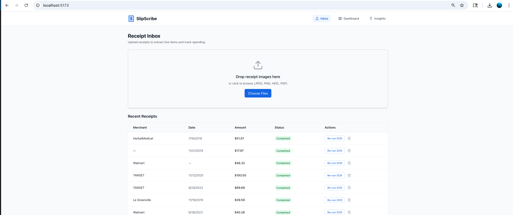
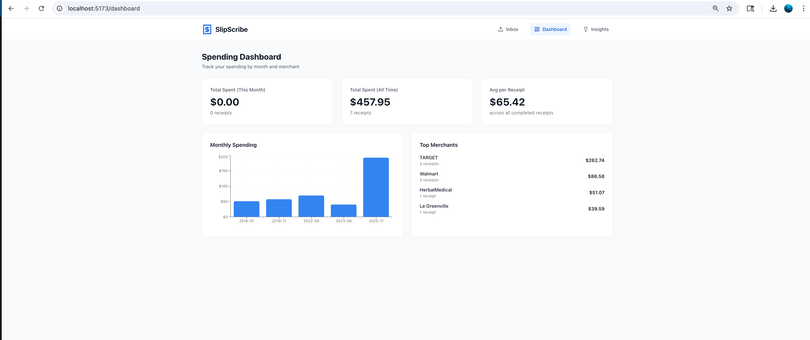

# SlipScribe

SlipScribe is a receipt and bill vault that converts images into structured, searchable spending data.

## What It Does
- Upload receipt images from the frontend inbox.
- Run OCR and extraction in the backend.
- Store normalized receipt data (merchant, totals, taxes, line items).
- Search receipts and review details.
- Export receipt data for reporting workflows.

## Screenshots

### Homepage


### Dashboard


## Current Stack
- Frontend: React + Vite + TypeScript
- Backend: FastAPI + SQLAlchemy + Alembic + Celery
- Data services: PostgreSQL + Redis + Milvus + MinIO
- LLM/OCR providers: OpenAI, Groq, Mistral (configurable)

See `TECH_STACK.md` for details.

## Repository Layout
```text
backend/      FastAPI app, models, services, migrations
frontend/     React app (Vite)
db/           SQL seed + migration helpers
scripts/      Start/stop and dev convenience scripts
openapi.yaml  API contract snapshot
```

## Quick Start

### 1) Prepare env file
```bash
cp .env.example .env
```

Update `.env` with your API keys (at least one provider key).

### 2) Start everything (recommended)

macOS/Linux:
```bash
./scripts/start-all.sh
```

macOS/Linux (foreground logs):
```bash
./scripts/dev.sh
```

Windows:
```cmd
scripts\start-all.bat
```

### 3) Open apps
- Frontend: `http://localhost:5173`
- Backend: `http://localhost:8000`
- API Docs: `http://localhost:8000/docs`
- MinIO Console: `http://localhost:9001`

## Stop Services
macOS/Linux:
```bash
./scripts/stop.sh
```

Windows:
```cmd
scripts\stop.bat
```

## Manual Development Setup

### Infrastructure
```bash
docker-compose up -d
```

### Backend
```bash
cd backend
python -m venv venv
source venv/bin/activate
pip install -r requirements.txt
alembic upgrade head
uvicorn app.main:app --reload
```

### Frontend
```bash
cd frontend
pnpm install
pnpm dev
```

### Worker (optional)
```bash
cd backend
source venv/bin/activate
celery -A app.celery_app:celery_app worker --loglevel=info
```

## Core Docs
- Setup guide: `SETUP.md`
- Script usage: `scripts/README.md`
- Project plan: `PROJECT_PLAN.md`
- API spec: `openapi.yaml`

## Environment Variables
Primary configuration lives in `.env`.

Commonly required values:
- `DATABASE_URL`
- `REDIS_URL`
- `JWT_SECRET`
- One provider key such as `OPENAI_API_KEY` or `GROQ_API_KEY`

Use `.env.example` as the source of truth for available variables.

## Status
Early development (MVP in progress).
